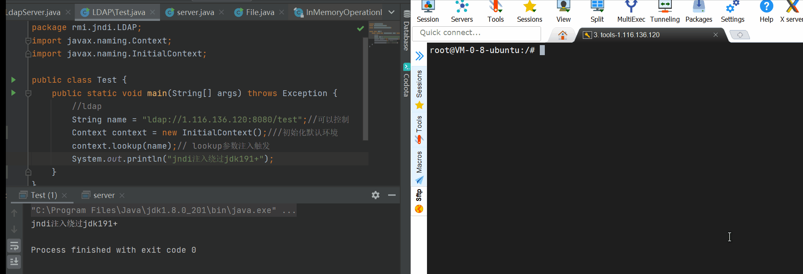

# LdapBypassJndi

[中文版本(Chinese version)](README.zh-cn.md)

>The function of the tool is to inject JNDI through LDAP

Principle: use LDAP to return serialized data and trigger local gadget

Use:  **Java - jar ldapbypassjndi.jar port poc.ser**

Port: is the listening port, which is equivalent to the listening port of the server

Poc.ser: serializes Base64 encoded gadgets

```
java -jar ysoserial.jar CommonsCollections6 "calc" | base64 >win-cc6-calc-poc.ser
```



In short, it is equivalent to a deserialization entry. To use it, you need to have a local one.

>Reference resources:
>
>https://kingx.me/Restrictions-and-Bypass-of-JNDI-Manipulations-RCE.html
>
>https://www.mi1k7ea.com/2020/09/07/%E6%B5%85%E6%9E%90%E9%AB%98%E4%BD%8E%E7%89%88JDK%E4%B8%8B%E7%9A%84JNDI%E6%B3%A8%E5%85%A5%E5%8F%8A%E7%BB%95%E8%BF%87/

